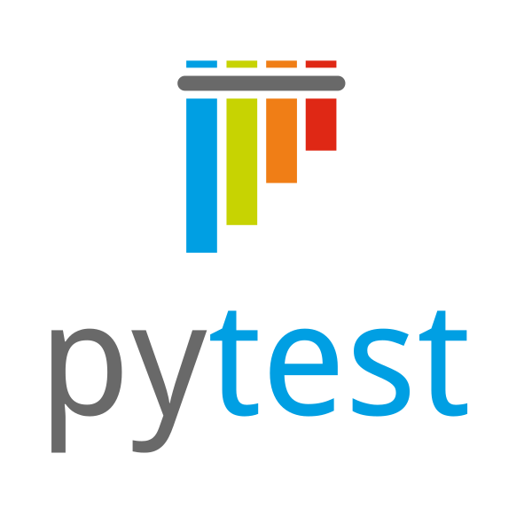

<h1 align="center">Hey There </h1>

 ---

### :man_technologist: &nbsp;About Me :
- :ballot_box_with_check: I’m Full Stack QA Automation engineer working on both frontend and backend
- :ballot_box_with_check: I am certified Oracle SQL associate
- :ballot_box_with_check: I'm mentoring Manual QA engineers to start their Automation career
- :ballot_box_with_check: Get contacted with me via:

### 🛠️ Languages and Tools :

&nbsp;
&nbsp;
&nbsp;

